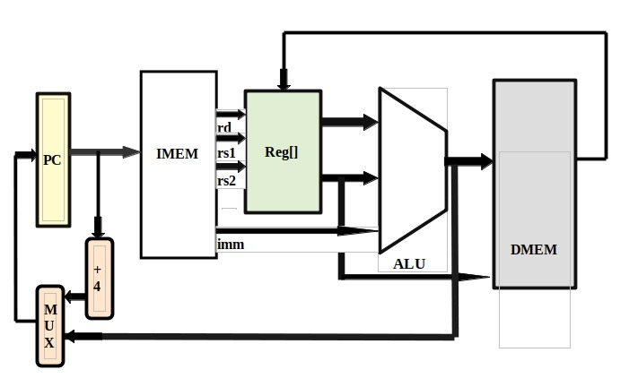
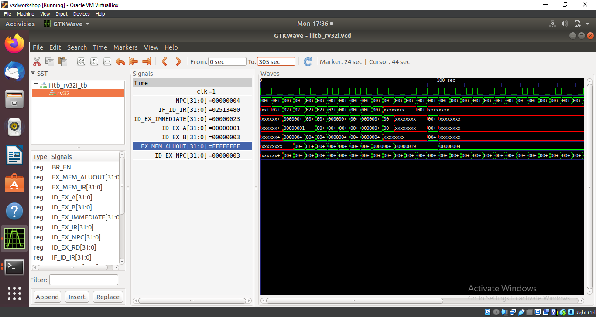

# Main Components of RV32I Architecture:

## 1. Registers:

* 32 General Purpose Registers (x0 - x31)

* Program Counter (PC)

## 2. Arithmetic Logic Unit (ALU):

* Performs arithmetic and logical operations.
* Inputs: Two 32-bit operands (from registers or immediate values).
* Output: Result of the operation.

## 3. Instruction Memory:

* Stores the program instructions.
* Addressed by the Program Counter (PC).

## 4. Data Memory:

* Stores data for load/store operations.
* Accessed via load (LW) and store (SW) instructions.

## 5. Control Unit:

* Decodes the instruction.
* Generates control signals to direct the operation of other components.

## 6. Immediate Generator:

* Extracts and sign-extends immediate values from instructions.

## 7. Multiplexers (MUX):

* Select between different inputs based on control signals.
* Example: Selecting between register operand or immediate value for ALU input.

## 8. Branch Target Calculation:

* Computes the target address for branch instructions.

## 9. Jump Target Calculation:

* Computes the target address for jump instructions.

# RV32I Architecture Diagram



## Here is a step-by-step breakdown of how these components are connected and interact.

## 1] Program Counter (PC):

* Points to the current instruction in the Instruction Memory.
* Connected to the Instruction Memory to fetch the instruction.

## 2] Instruction Fetch:

* The instruction at the address in the PC is fetched from the Instruction Memory.

## 3] Instruction Decode:

* The fetched instruction is sent to the Control Unit.
* The Control Unit decodes the instruction and generates appropriate control signals.
* The instruction is also sent to the Immediate Generator, which extracts any immediate value.

## 4] Register File:

* Contains 32 general-purpose registers.
* Two source registers (rs1, rs2) are read based on the instruction.
* The destination register (rd) is specified for the result.

## 5] ALU Operations:

* The ALU performs the operation specified by the instruction.
* Inputs to the ALU can be register values or an immediate value (selected via a MUX).
* The result is sent back to the Register File or Data Memory.

## 6] Data Memory Access:

* For load (LW) and store (SW) instructions, Data Memory is accessed.
* The address for Data Memory is calculated by the ALU.
* Data is loaded from or stored to Data Memory based on the instruction.

## 7] PC Update:

* The PC is updated to point to the next instruction.
* For branch and jump instructions, the target address is calculated and loaded into the PC

# Installing Verilog 

* Installing Commands

```
* sudo apt-get update  
* sudo apt-get install iverilog gtkwave 
```
* Execution Commands

```
  * iverilog -o iiitb_rv32i_1 rv32i/iiitb_rv32i.v rv32i/iiitb_rv32i_tb.v
  * ./iiitb_rv32i_1
  ```
* Gtk wave Command
```
gtkwave iiitb_rv32i.vcd
```
# Code to be executed

* Commands can be updated in rv32i/iiitb_rv32i.v by storing 32bit hex codes as generated in Practical3 in IMEM stack program memory

```
always @(posedge RN) begin
    //NPC<= 32'd0;
MEM[0] <= 32'h00f507b3;         //add a5,a0,a5.(i1)
MEM[1] <= 32'h40f70733;         //sub a4,a4,a5.(i2)
MEM[2] <= 32'h014e7e33;         //and t3,t3,s4.(i3)
MEM[3] <= 32'h00c8e8b3;         //or a7,a7,a2.(i4)
MEM[4] <= 32'h00f44433;         //xor s0,s0,a5.(i5)
MEM[5] <= 32'h02415580;         //slt r11,r2,r4.(i6)
MEM[6] <= 32'h00520600;         //addi r12,r4,5.(i7)
MEM[7] <= 32'h00209181;         //sw r3,r1,2.(i8)
MEM[8] <= 32'h0007a783;         //lw a5,0(a5).(i9)
MEM[9] <= 32'h00f00002;         //beq r0,r0,15.(i10)
MEM[25] <= 32'h00210700;         //add r14,r2,r2.(i11)
end
```
# GTKWave Simulation


